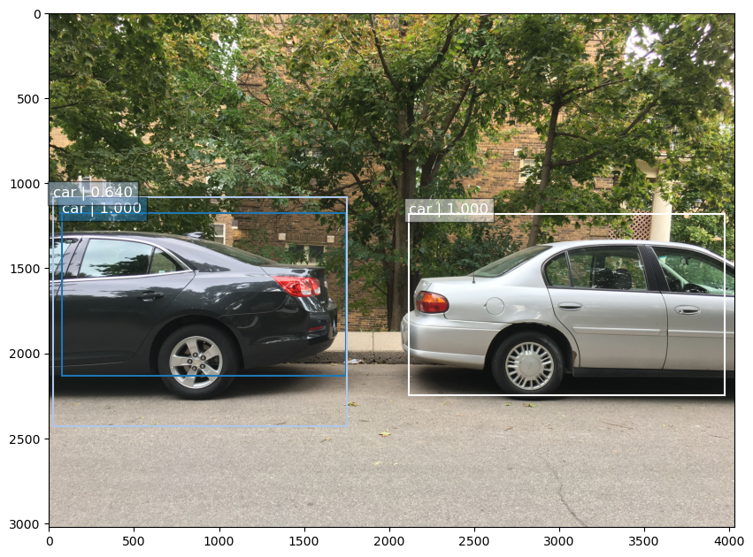
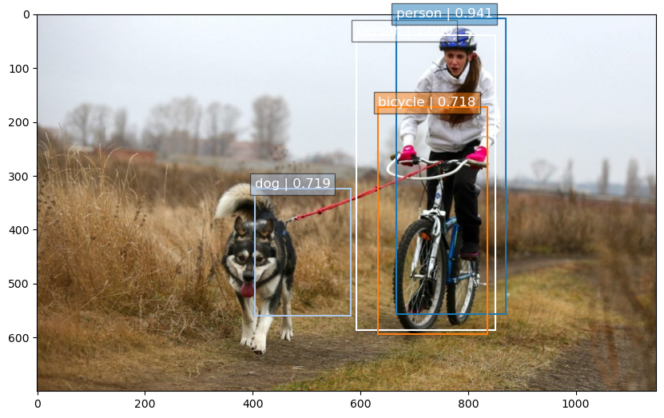

# Single Shot Detector in Tensorflow 2.0

This repository contains the a Tensorflow 2.0 implementation of the SSD model introduced in this research [article](http://arxiv.org/abs/1512.02325).

At present it only implements the VGG-based SSD nwtwork with 300 input.

# Results

I trained the model for a couple of thousand iterations. Here are some exaples of model outputs:

